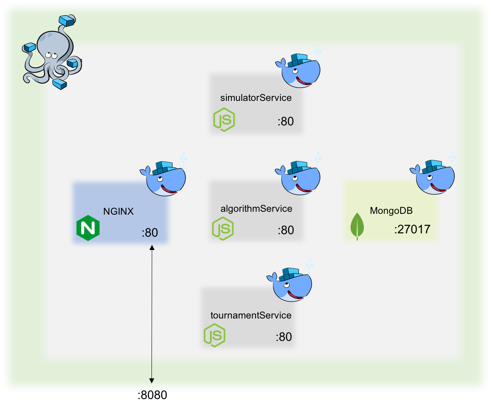

# AI Challenge [](https://travis-ci.org/facebook/react) [](CONTRIBUTING.md#pull-requests)

AI Challenge is a framework for fascilitating artificial intelligence (AI) tournaments.

* **Microservice Architecture:** The AI Challenge framework conforms to a microservice architecture. As a result, each component can be deployed, swapped, maintained, implemented, tested, and scaled independently.
* **Component-Based:** This framework is composed of three primary components. While each is needed to utilize all the benefits of AI Challenge, they can be used independently as they each offer a unique set of functionality. Based on how you implement the framework for your application specific needs, you may choose to swap out or modify each component as needed.
* **Dockerized:** Each component of the framework contains a [Dockerfile](https://docs.docker.com/engine/reference/builder/) which will create a Docker container for that component. Docker Compose is used to run this multi-container framework.
* **Production Ready:** This framework is ready to be deployed out of the box with either Kubernetes or Docker-Compose.

## Table of Contents
* [Framework Uses](#framework-uses)
* [Components](#components)
* [Installation](#installation)
  * [Docker-Compose](#docker-compose)
  * [Kubernetes](#kubernetes)
  * [Local](#local)
* [Architecture](#architecure)
  * [Docker-Compose](#docker-compose-1)
  * [Kubernetes](kubernetes-1)
* [API](#installation)
  * [Docker-Compose](#docker-compose-2)
  * [Kubernetes](kubernetes-2)
* [Example](#installation)
  * [Algorithm Component](#algorithm-component)
  * [Simulator Component](#simulator-component)
  * [Tournament Component](#tournament-component)
    * [Play the tournament](#play-the-tournament)
    * [Get matches list](#get-matches-list)
* [Contributing](#contributing)
* [License](#license)

## Framework Uses

Here are some example uses of AI Challenge:

* **Recruiting:** AI Challenge can be used to facilitate the quantitative assessment of a developer’s proficiency in an objective manner.
* **Kids:** AI Challenge can be used to teach children about artificial intelligence and/or algorithm theory. 
* **Competitions:** AI Challenge can be used to conduct competitive programming competitions among developers.

## Components

AI Challenge is composed of three primary components which are explained below. Note that detailed documentation for each component can be found in their respective README files.

* **Algorithm Service:** Fascilitates create/retrieve/update/delete (CRUD) operations on AI implementations. Each AI conforms to an interface of specific functions. Reference the [documentation](./algorithmService/README.md) for detailed information.
* **Simulator Service:** Preforms a simulation of two AI implementations. Reference the [documentation](./simulationEngine/README.md) for detailed information.
* **Tournament Service:** Fascilitaes a tournament of AI implementations. Reference the [documentation](./tournamentEngine/README.md) for detailed information.

## Installation

#### Docker-Compose

The fastest way to get started is to bring up the framework using [Docker Compose](https://docs.docker.com/compose/). You can use [Docker Native](https://www.docker.com/products/overview) to accomplish this locally:

```sh
<!-- From the directory that hosts your docker-compose.yml file -->
docker-compose up
```

#### Kubernetes 

#### Local
You can also run the individual components separately. See their respective README files for setup instructions.

## Architecure
Because of it's microservice architecture, AI Challenge can be successfully deployed in many ways!

#### Docker-Compose

Each microservice is Dockerized and Docker Compose is used to run this multi-container setup. Nginx is used to proxy external service discovery. Internal service discovery is accomplished via an overlay network that Docker Compose provides.

*NOTE:* This is not intended to be a production architecture as it ignores security and container orchestration.



#### Kubernetes

## API
Each component has its own [Swagger](http://swagger.io/) schema. See each component's documentation for details.

Here are the base paths for the above architectures:

#### Docker-Compose

component | base path
--------- | ------- 
algorithm | `http://localhost:8080/algorithmservice/` 
simulator | `http://localhost:8080/simulatorservice/`  
tournament | `http://localhost:8080/tournamentservice/`

#### Kubernetes

component | base path
--------- | ------- 
algorithm | `http://localhost:8080/algorithmservice/` 
simulator | `http://localhost:8080/simulatorservice/`  
tournament | `http://localhost:8080/tournamentservice/`

## Example

We'll assume you've installed the framework using the Docker-Compose option above.

### Algorithm Component
In order to fascilitate a tournament, AI implementations are needed. The following illustrates how an implementation might be submitted. See the full [documentation](./algorithmService/README.md) for more details.

```js
function initializeSimulation() {
	//optional
}

function initializeGame() {
	var x = -1, y = 0;
    this.getNextCoord = function() {
        if (++x > 9) {
            x = 0;
            ++y;
        }
        return {
            x: x,
            y: y
        };
    }
}

function startGame() {
	this.player.grid.placeBlock(0, 0, Block.VERTICAL, Collection.ONEBYTWO);
    this.player.grid.placeBlock(1, 0, Block.VERTICAL, Collection.ONEBYTHREE);
    this.player.grid.placeBlock(2, 0, Block.VERTICAL, Collection.ONEBYFOUR);
    this.player.grid.placeBlock(3, 0, Block.VERTICAL, Collection.ONEBYFIVE);
    this.player.grid.placeBlock(4, 0, Block.VERTICAL, Collection.ONEBYSIX);
}

function shoot() {
	var coords = this.getNextCoord();
    var result = this.player.shoot(coords.x, coords.y);
}

function endGame() {
	//optional	
}
```
The following shows an example of how you might submit the functions that make up an AI to the `algorithm service`

```js
function getBody(func) {
	return func.toString().match(/function[^{]+\{([\s\S]*)\}$/)[1];
}

$.ajax({
    type: "POST",
    url: "http://localhost:8080/algorithmservice/algorithms/test",
    data: { 
        email: 'frankgreco@northwesternmutual.com',
        name: 'Frank B Greco Jr',
        initializeSimulation: getBody(initializeSimulation),
        initializeGame: getBody(initializeGame),
        startGame: getBody(startGame),
        endGame: getBody(endGame),
        shoot: getBody(shoot),
        date: new Date().getTime()
    }
});
```

### Simulator Component
The simulator component is used to conduct a simulation of two AI implementations. The following illustrates a sample API call and JSON response. See the full [documentation](./simulatorService/README.md) for AI implementation details.

```sh
http://localhost:8080/simulatorservice/simulation?algorithmOneID=580bee73f2c4c40015fdd8b8&algorithmTwoID=580bee79f2c4c40015fdd8b9&collection=test&simulations=1000
```

```json
{
  "playerOne": {
    "wins": 494,
    "losses": 506,
    "accuracy": 0.3576734006734019,
    "name": "Frank B Greco Jr",
    "id": "580bf21cf2c4c40015fdd8bf"
  },
  "playerTwo": {
    "wins": 506,
    "losses": 494,
    "accuracy": 0.3578148148148166,
    "name": "Frank B Greco Jr",
    "id": "580bf21df2c4c40015fdd8c0"
  }
}
```

### Tournament Component
See the full [documentation](./tournamentService/README.md) for more details.

There are two ways that the tournament component can be used (the following example has two submitted AI implementations):  

#### 1. Play the tournament
Since the time that it will take to complete a tournament may be longer than we want to keep an HTTP request open, we use the following sequence:
 1. Initiate a tournament.
 2. Request responds immediately with the id of the tournament and the current status.
 3. Check at any time for the status of the tournament using the tournament id.

```sh
http://localhost:8080/tournamentservice/play/test?games=1000
```
```json
{
  "status": "tournament in progress",
  "lastUpdated": 1477184837006,
  "_id": "580c0d45bd3b84574d930c99"
}
```
```sh
http://localhost:8080/tournamentservice/tourament/580c0d45bd3b84574d930c99
```
```json
{
  "_id": "5807b508e9236ae1ecc10bba",
  "status": "tournament completed",
  "lastUpdated": 1476900109346,
  "results": [
    {
      "wins": 515,
      "losses": 485,
      "email": "frankgreco@northwesternmutual.com",
      "id": "5804e98a8be19a7152b30e55"
    },
    {
      "wins": 485,
      "losses": 515,
      "email": "frankgreco@northwesternmutual.com",
      "id": "5804e9748be19a7152b30e54"
    }
  ]
}
```
#### 2. Get matches list
This option appeals in situations where a potential UI might want more control of the tournament. By returning a list of matches, the UI can execute the simulations individually.
```sh
http://localhost:8080/tournamentservice/matches/test
```
```json
{
  "matches": [
    {
      "algorithmOne": {
        "_id": "580bf21cf2c4c40015fdd8bf",
        "initializeSimulation": "",
        "shoot": "var coords=this.getNextCoord();var result=this.player.shoot(coords.x, coords.y);",
        "email": "frankgreco@northwesternmutual.com",
        "initializeGame": "var x=-1,y=0;this.getNextCoord=function(){if(++x>9){x=0;++y;}return{x:x,y:y};}",
        "startGame": "this.player.grid.placeBlock(0,0,Block.VERTICAL,Collection.ONEBYTWO);this.player.grid.placeBlock(1,0,Block.VERTICAL,Collection.ONEBYTHREE);this.player.grid.placeBlock(2,0,Block.VERTICAL,Collection.ONEBYFOUR);this.player.grid.placeBlock(3,0,Block.VERTICAL,Collection.ONEBYFIVE);this.player.grid.placeBlock(4,0,Block.VERTICAL,Collection.ONEBYSIX);",
        "endGame": "",
        "date": "1475186162289",
        "name": "Frank B Greco Jr"
      },
      "algorithmTwo": {
        "_id": "580bf21df2c4c40015fdd8c0",
        "initializeSimulation": "",
        "shoot": "var coords=this.getNextCoord();var result=this.player.shoot(coords.x, coords.y);",
        "email": "frankgreco@northwesternmutual.com",
        "initializeGame": "var x=-1,y=0;this.getNextCoord=function(){if(++x>9){x=0;++y;}return{x:x,y:y};}",
        "startGame": "this.player.grid.placeBlock(0,0,Block.VERTICAL,Collection.ONEBYTWO);this.player.grid.placeBlock(1,0,Block.VERTICAL,Collection.ONEBYTHREE);this.player.grid.placeBlock(2,0,Block.VERTICAL,Collection.ONEBYFOUR);this.player.grid.placeBlock(3,0,Block.VERTICAL,Collection.ONEBYFIVE);this.player.grid.placeBlock(4,0,Block.VERTICAL,Collection.ONEBYSIX);",
        "endGame": "",
        "date": "1475186162289",
        "name": "Frank B Greco Jr"
      },
      "url": "?algorithmOneID=580bf21cf2c4c40015fdd8bf&algorithmTwoID=580bf21df2c4c40015fdd8c0&collection=test&simulations=1000"
    }
  ]
}
```

## Contributing

AI Challenge welcomes pull requests. See the [contribution guide](./CONTRIBUTING.md) for details.

### License

AI Challenge is [MIT licensed](./LICENSE).